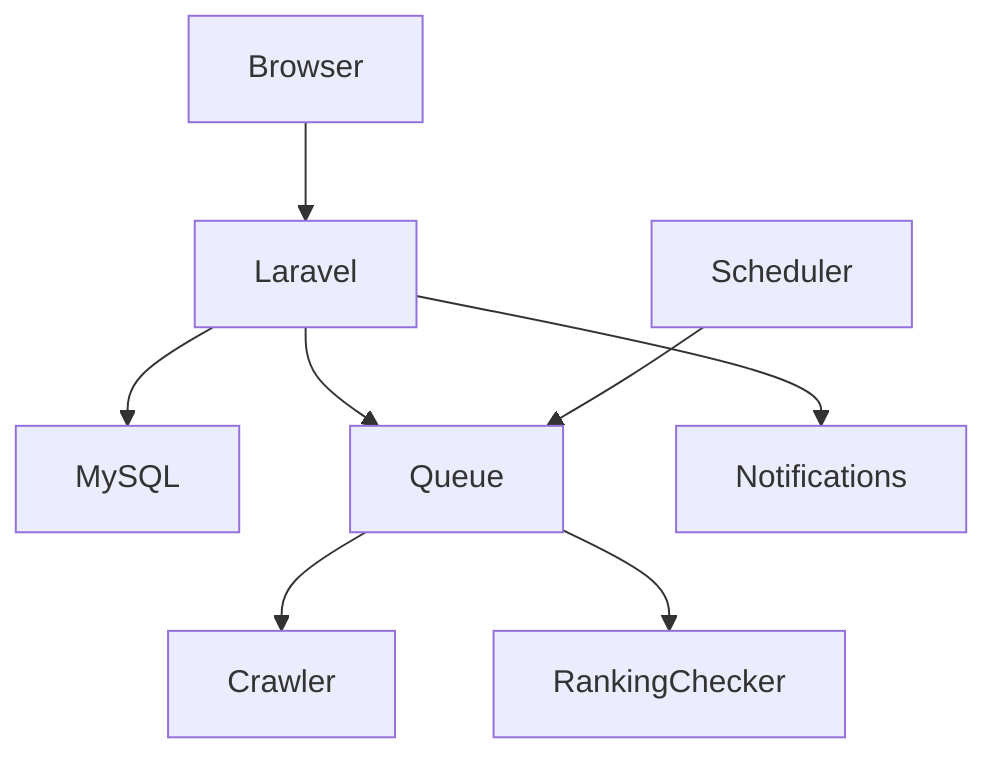
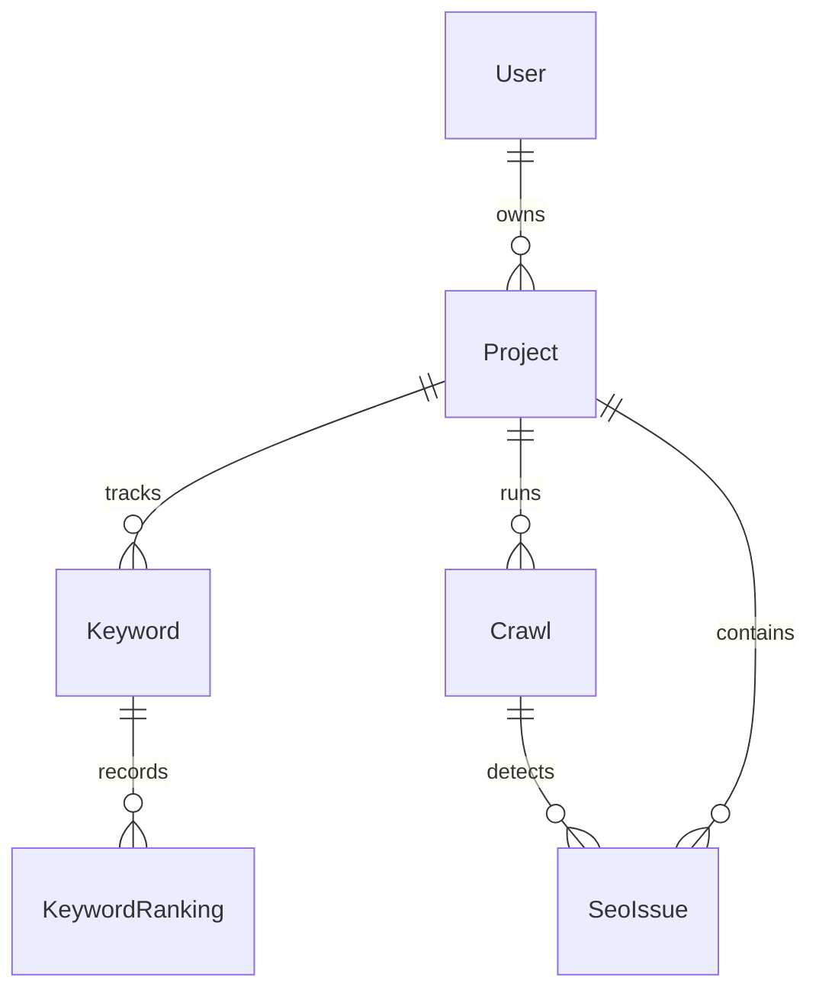

# RankWatch

Simple SEO monitoring for websites that want to grow.

RankWatch is a lightweight Laravel SaaS for website owners, freelancers, and small agencies. It tracks website projects, keyword rankings, ranking history, lightweight technical SEO crawls, SEO issues, scores, and printable reports in a conventional Laravel-native modular monolith.

The application intentionally stays simple: Blade-rendered pages, Eloquent models, Form Requests, Policies, Jobs, Notifications, and a small services layer. There is no SPA, API gateway, microservice split, or unnecessary repository layer.

## Features

- Breeze authentication with registration, login, logout, password reset, and email verification
- Owner-scoped project management for tracked websites
- Keyword tracking with current, previous, best, and changed positions
- Historical keyword ranking records
- Configurable external ranking provider through `RANKING_API_URL` and `RANKING_API_KEY`
- Deterministic demo ranking fallback when no ranking API is configured
- Lightweight technical SEO crawler
- SEO issue detection, severity filtering, and per-occurrence resolution
- SEO score based on open issues from the latest completed crawl
- Current SEO state derived from the latest successfully completed crawl
- Queue-based manual crawls with throttling and per-project overlap protection
- Daily scheduled crawls and keyword ranking checks
- Email notifications for crawl completion, critical issues, and keyword drops
- Printable project reports
- Server-rendered marketing pages, `sitemap.xml`, and `robots.txt`
- Demo seed data for local portfolio walkthroughs
- Responsive Blade UI styled with Tailwind CSS and small Alpine.js interactions

## Screenshots

Screenshots will be added as the UI is finalized.

## Tech Stack

Backend:

- PHP 8.3+
- Laravel 12
- MySQL 8+

Frontend:

- Blade
- Tailwind CSS
- Alpine.js
- Vite

Laravel infrastructure:

- Database Queue
- Database Cache
- Laravel Scheduler
- Laravel Notifications
- Laravel HTTP Client

Testing:

- Pest
- PHPUnit runtime

## Architecture

RankWatch is a modular monolith. The core application lives in normal Laravel layers:

- Controllers
- Form Requests
- Models
- Policies
- Services
- Jobs
- Notifications



The goal is maintainable Laravel code that is easy to inspect, run, and extend.

## SEO Crawler

The crawler inspects project homepages and internal links within configured limits. It currently checks:

- HTTP status
- Page title
- Meta description
- H1 count
- Canonical tag
- Robots meta `noindex`
- Image alt attributes
- Broken internal links
- HTTPS usage
- Response time
- Non-HTML responses
- Oversized responses

Historical crawl records and their issues are preserved. The latest successfully completed crawl represents the project's current technical SEO state for dashboards, reports, issue counts, and SEO score.

## Crawler Safety

Crawler input is treated as untrusted. RankWatch includes guardrails for outbound crawl requests:

- HTTP/HTTPS-only URLs
- Credentials in URLs rejected
- Private, loopback, link-local, metadata, reserved, multicast, and obvious localhost targets blocked
- DNS validation across all resolved addresses
- Unsafe ports rejected
- Redirects followed manually with every target revalidated
- Request budget per crawl
- Maximum pages and links inspected per page
- Response body limit with Content-Length precheck where available
- HTML content-type gate before DOM parsing
- Connection and request timeouts
- Redirect limit
- Manual crawl throttling
- Per-project crawl overlap protection

The crawler revalidates resolved destinations before outbound requests, while transport-level DNS re-resolution remains a residual limitation.

## Keyword Ranking

Keywords belong to projects. Each ranking check stores a `keyword_rankings` history row, and the UI derives current, previous, best, and changed positions from that history.

RankWatch does not aggressively scrape search engines. The ranking checker is designed around a configurable external SERP provider. When `RANKING_API_URL` is empty, it uses a deterministic demo fallback so local seeded demos remain useful.

## Database Model

Core entities:

- `User` owns many `Project` records
- `Project` has many `Keyword`, `Crawl`, and `SeoIssue` records
- `Keyword` has many `KeywordRanking` records
- `Crawl` has many `SeoIssue` records
- `SeoIssue` belongs to both a `Project` and a `Crawl`



## Installation

```bash
git clone <repository-url>
cd rank-watch
composer install
npm install
cp .env.example .env
php artisan key:generate
```

On Windows PowerShell, use:

```powershell
Copy-Item .env.example .env
```

Create a MySQL database, then update the database values in `.env`.

```bash
php artisan migrate --seed
npm run build
```

## Environment Variables

Important local variables:

```env
APP_URL=http://localhost:8000

DB_CONNECTION=mysql
DB_HOST=127.0.0.1
DB_PORT=3306
DB_DATABASE=rankwatch
DB_USERNAME=root
DB_PASSWORD=

QUEUE_CONNECTION=database
CACHE_STORE=database

MAIL_MAILER=log
MAIL_FROM_ADDRESS="hello@example.com"

RANKING_API_URL=
RANKING_API_KEY=
RANKWATCH_CRAWL_LIMIT=8
```

Do not commit real credentials or API keys.

## Demo Data

The database seeder creates a local demo account:

- Email: `demo@rankwatch.test`
- Password: `password`

It also creates an Acme Coffee project, sample keywords, historical rankings, one completed crawl, and example SEO issues.

These credentials are for local seeded demos only.

## Development

Run the Laravel server:

```bash
php artisan serve
```

Run Vite during frontend development:

```bash
npm run dev
```

Run the queue worker:

```bash
php artisan queue:work
```

## Queue

RankWatch uses Laravel's database queue by default.

Manual crawls are queued and require a queue worker:

```bash
php artisan queue:work
```

Using `QUEUE_CONNECTION=sync` will execute dispatched jobs synchronously and is not recommended for normal RankWatch operation. Redis is not required.

## Scheduler

The scheduler runs one daily task at `02:00` that dispatches:

- project crawl jobs
- keyword ranking check jobs

Inspect the schedule:

```bash
php artisan schedule:list
```

Run it manually:

```bash
php artisan schedule:run
```

Production cron concept:

```cron
* * * * * php /path/to/rank-watch/artisan schedule:run >> /dev/null 2>&1
```

## Testing

```bash
php artisan test
```

The test suite covers authorization, project isolation, keyword history, SEO scoring, crawler SSRF protections, crawler resource limits, queued crawl behavior, per-project overlap locking, current issue lifecycle semantics, and ranking history.

At the first production-readiness checkpoint, the suite passed `73` tests and `158` assertions under PHP `8.3.33`.

## Public SEO

The public marketing site uses server-rendered Blade HTML with:

- Metadata and descriptions
- Canonical URLs
- Open Graph metadata
- Twitter/X card metadata
- Semantic HTML sections
- `sitemap.xml`
- `robots.txt`

Authenticated application pages use the app layout with `noindex,nofollow`.

## Deployment Notes

Production requirements:

- PHP 8.3+
- Required PHP extensions for Laravel, MySQL, XML/DOM, mbstring-compatible string handling, OpenSSL, and HTTP/cURL support
- MySQL 8+
- Web server configured for Laravel's `public` directory
- Queue worker for database queue jobs
- Scheduler cron entry
- Mail transport
- Correct `APP_URL`
- `APP_ENV=production`
- `APP_DEBUG=false`

Build assets and run migrations during deployment:

```bash
npm run build
php artisan migrate --force
```

The queue worker should be supervised in production.

## Security Notes

RankWatch uses Laravel defaults for authentication, password hashing, CSRF protection, session handling, route middleware, escaped Blade output, Form Requests, and Policies.

Project access is owner-scoped. Nested project resources such as keywords, reports, crawl actions, and issue resolution perform server-side authorization or ownership checks.

## Roadmap

- Richer historical crawl comparison
- Additional ranking provider adapters
- Performance tuning for larger datasets
- PDF report export
- Optional Redis-backed queue/cache infrastructure
- More detailed report views

## License

RankWatch is open-sourced under the MIT license.
